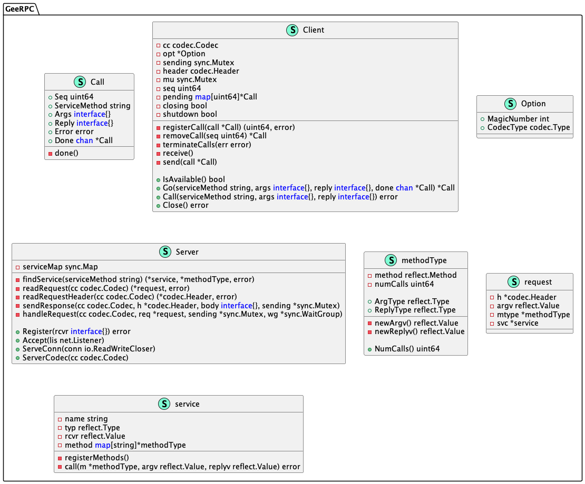
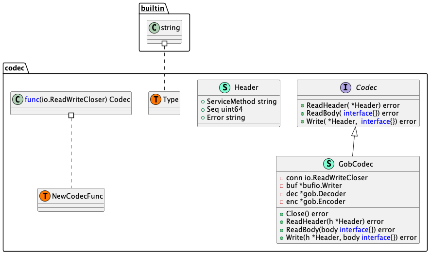

# GeeRPC

## RPC需要满足的条件
```go
func (t *T) MethodName(argType T1, replyType *T2) error
```
1. 方法类型（T）是导出的（首字母大写）
2. 方法名（MethodName）是导出的
3. 方法有2个参数(argType T1, replyType *T2)，均为导出/内置类型
4. 方法的第2个参数一个指针(replyType *T2)
5. 方法的返回值类型是 error

## UML类图



