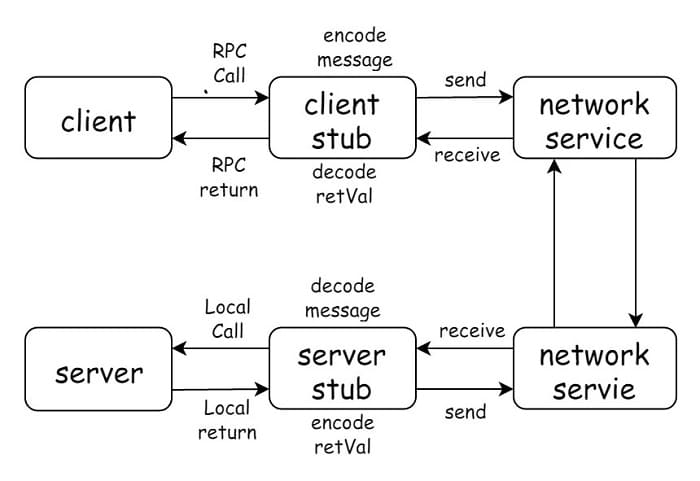

# GeeRPC

## RPC需要满足的条件
```go
func (t *T) MethodName(argType T1, replyType *T2) error
```
1. 方法类型（T）是导出的（首字母大写）
2. 方法名（MethodName）是导出的
3. 方法有2个参数(argType T1, replyType *T2)，均为导出/内置类型
4. 方法的第2个参数一个指针(replyType *T2)
5. 方法的返回值类型是 error

## UML类图




## 代码结构
```
├── client
│   └── client.go
├── codec
│   ├── codec.go
│   ├── codec_test.go
│   ├── common.go
│   ├── gob.go
│   ├── json.go
│   └── proto.go
├── geerpc.go
├── go.mod
├── go.sum
├── server
│   └── server.go
└── xclient
    └── xclient.go
```
    
## RPC 负载均衡
